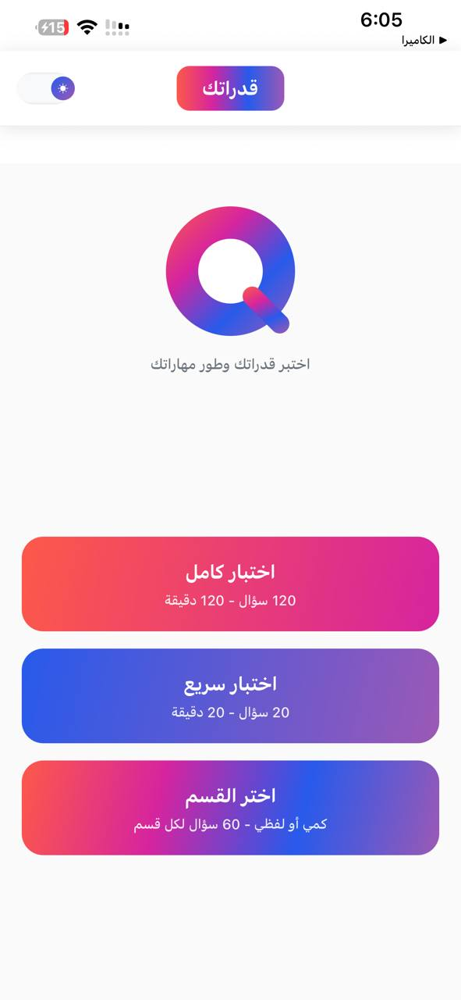
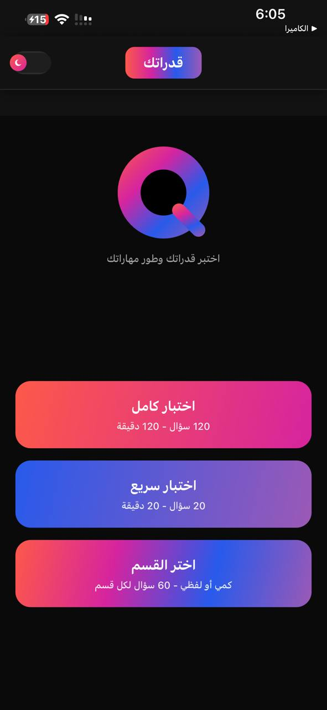
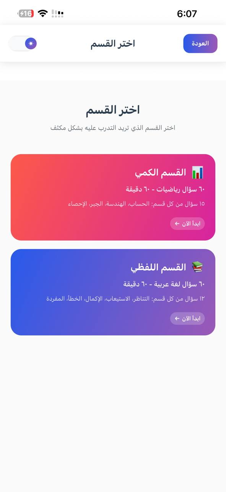
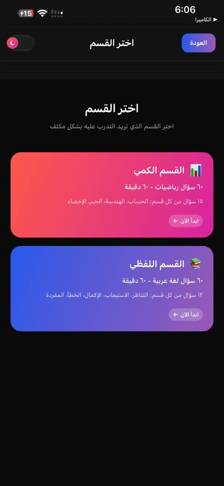
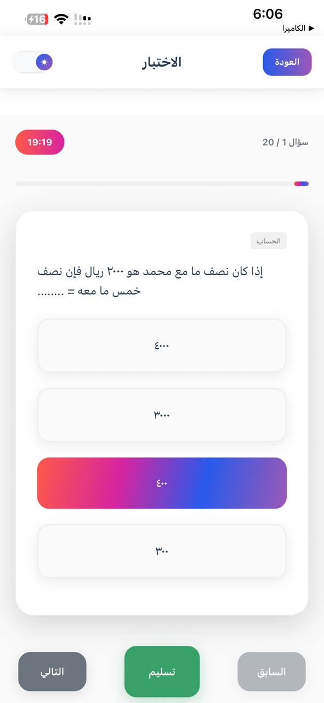
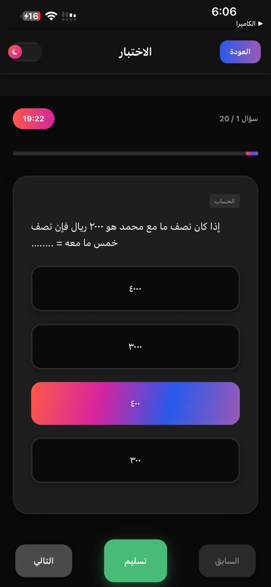
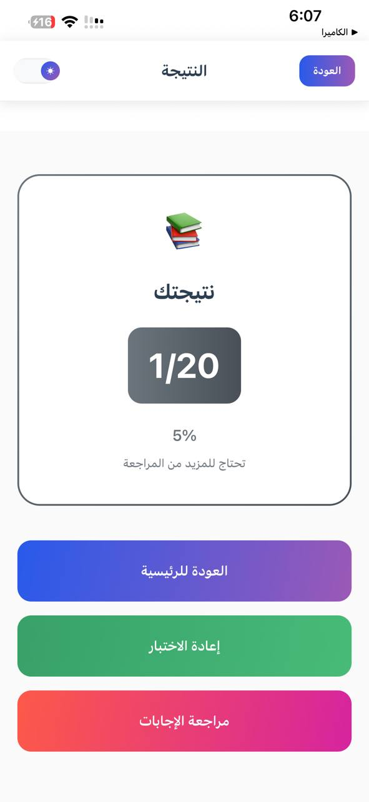
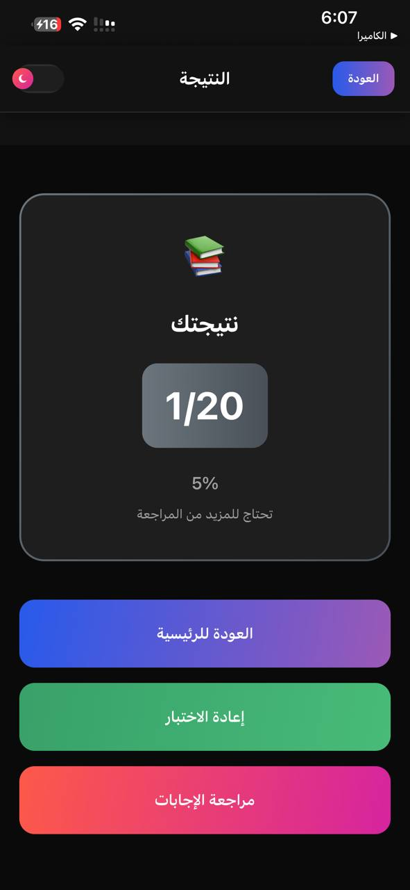

# Qudratak - General Aptitude Test Preparation 📱

### 🚀 Overview
**Qudratak** is a high-performance React Native application designed to simulate the real General Aptitude Test (Qudrat). It features a sophisticated exam generation algorithm, a modern responsive UI, and full Arabic (RTL) support.

> *Note: This repository is a portfolio showcase. The source code is private to protect intellectual property.*

---

### 📸 App Preview (Light vs Dark Mode)

| Screen | Light Mode | Dark Mode |
|:---:|:---:|:---:|
| **Home** |  |  |
| **Sections** |  |  |
| **Quiz** |  |  |
| **Result** |  |  |

---

### 💡 Key Technical Features

#### 1. Smart Exam Generation (Stratified Sampling)
Unlike basic quiz apps that pick random questions, Qudratak uses a weighted algorithm to generate realistic exams:
*   **Full Exam Mode:** Generates 120 questions balanced across **4 Math sections** and **5 Arabic sections** exactly like the real test.
*   **Quick Quiz:** A rapid 20-question session with proportional distribution logic.

#### 2. Performance & Optimization
*   **Component Isolation:** Utilized `React.memo` to isolate question rendering. This prevents expensive re-renders and image flickering when the timer updates every second.
*   **Offline First:** All assets and logic are bundled locally, ensuring 100% uptime without an internet connection.

#### 3. UI/UX & Tech Stack
*   **Framework:** React Native / Expo (SDK 54).
*   **Styling:** Custom "Gradient-style" Gradient Components and fully persistent **Dark/Light Theme** context.
*   **Localization:** Fully optimized RTL (Right-to-Left) layout for Arabic content.

---

### 📬 Contact
If you are interested in the technical details or the development process, feel free to reach out to me via LinkedIn.
